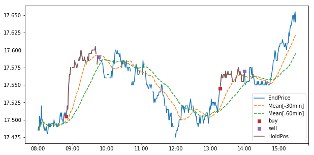

After getting feedback about the project both internally at Originate and externally, we have found out that:

- stock market professionals are skeptical of machine learning methods applied to the stock market
- stock market professionals want rigerous proof of performance

# Stategies

To address the first issue we plan to develop trading strategies including such that are automatically tuned.
We found out that while machine learning itself is applicable to stock price prediction, prediction alone is not enough.
One needs to incorporate the machine learning prediction scores in a trading strategy. Often machine learning blogs
related to stock prediction stop short of doing that, and thus the skeptisism.

# Third-party platforms such as Quantopian

While having access to minute-by-minute data enables offline exploration of various methods, those methods cannot be reliably tested
offline. Professionals require rigerous proofs of algorithm performance via:

- backtesting
- paper testing

We will address those issue be allowing the developed methods to work on [Quantopian](https://www.quantopian.com/).

## Domain-specific language for trading strategy specification

```

position = Position()
s.add_position(position)

gain_threshold = 0.0008
loss_threshold = 0.001

s.add_rule('buy when our predictor score is high',
    When(position.is_empty()).and_when(score >= 0.0001). \
      and_when(score2 >= 0.0001). \
      and_when(score3 >= 0.0001). \
      and_when(score2 >= score3 + 0.00005). \
      action(buy).into(position)
)

s.add_rule(
    'liquidate position when we have enough gain and its going down (for long pos)',
    When(position.is_long()). \
        and_when(expected_gain(end_price, position) >= gain_threshold). \
        and_when(score2 <= 0.0). \
        action(liquidate).into(position)
)


s.add_rule(
    'liquidate position under stop-loss rule',
    When(position.is_active()).and_when(expected_loss(end_price, position) >= loss_threshold).action(liquidate).into(position)
)
```



For example applying the strategy above to data for the stock 'RWE' on 2017-07-03 results in the following actions:

- buy at 08:49:00
- sell at 13:17:00
- buy at 09:46:00
- sell at 14:00:00

## Optimization of strategies

As seen above the specification of the strategy depends on a number of constants. Those need to be tuned on actual data.
We enable this by defining the constants as special type of variables that can be optimized by the back-tester.

```
gain_threshold = OptVariable(0.00001, 0.01)
loss_threshold = OptVariable(0.00001, 0.01)
# and in general replacing all majic constants by OptVariable with a range
```

## Domain-specific language for feature extraction and normalization


