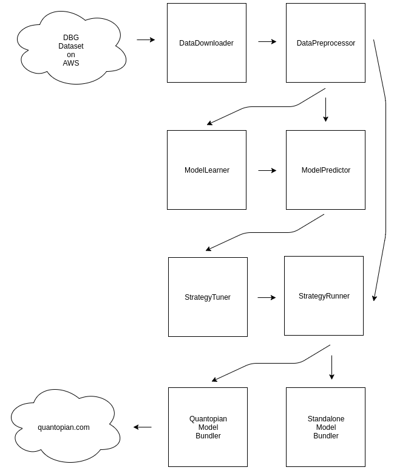

# Goals

The goal is to produce a small toolkit and library for evaluating stock market strategies based on predictive approaches.

By predictive approaches, we mean machine learning on quantities related to the stock market.

By stragegies, we mean simple rule based stragies which use the predictions of the machine learning models
and may apply simple techniques as thresholding, stop-loss rules, and so on.

The same code should be able to run on:

- the analyst's laptop using the DBG public dataset
- the quantopian.com website

# Stretch goals

Ideally, we should be able to demonstrate consistent gains on the models/strategies across multiple stocks
and also on quantopian.com. The strategies should be robust to slippage and costs.

# Non-goals

We don't aim to apply the most sophisticated modeling approaches at the intial stage. 
The focus is on robustness and usability of code.

# Toolkit



The toolkit will consist of the following commands

## Data Downloader

- Input: a date range and local directory
- Output: downloaded DBG dataset 

## Data Preprocessor

- Input: a local directory and a date range
- Output: preprocessed dataset suitable for machine learning

## Model Learner

- Input: objectives such as:
   - pct change t minutes ahead
   - gain predictition

- Output: a learned model


## Model Predictor

- Input: a test set and a single or multiple models
- Output: an extended test set containing the predicted scores

## Strategy Tuner

- Input: the ouput of model predictor and the name of a strategy
- Output: the parameters of a strategy

## Strategy Runner

- Input: strategy name, a parameter file from Strategy Tuner, and a dataset from Model Predictor
- Output: evaluation of a strategy

## Quantopian Model Bundler

- Input: strategy name, a parameter file from Strategy Tuner
- Output: a single file which contains all the model parameters and python code which can be run on quantopian.com

## Standalone (DBG) Model Bundler

- Input: strategy name, a parameter file from Strategy Tuner
- Output: a service to which data can be served on a minute by minute basis and which returns buy/sell decisions

# Libraries

We will build some of the above commands on two libraries

- Domain Specific Language (DSL) for stock timeseries
- Domain Specific Language (DSL) for strategies

## DSL for stock timeseries

As analysts we want to easily be able to express hypotheses. We opt to create a DSL similar to Pandas. This is for a number of reasons that we'll explain below.

### Time Variables

```
T = TimeVar(over=OfficialTradingMinutes,na_fill=...)
```

### Pandas-like DSL
```
T = TimeVar(...)
k = 20
interval = Interval(from=0, until=-k)
window_over_time = Over(T).RawSignal('EndPrice').RollingWindow(interval)
mean = window_over_time.Mean().Rename("mean")
std = window_over_time.Std().Rename("std")
normalized = mean/std
```

### Higher-level Features

#### Pointwise Arithmetic

```
const(0.7) 
0.8*f1
f1 + f2
f1 - f2
f1*f2
f1/f2
```


#### Arrays of features

```
interval = Interval(from=0, until=-k)

vector_at_t = Over(T).RawSignal('EndPrice').Range(interval)
```

#### Cluster centroids

```
clustering = KMeans(num_clusters=5)
interval = Interval(from=0, until=-k)
vector_at_t = Over(T).RawSignal('EndPrice').Range(interval)
# same as Range(...)
vector_at_t = Over(T).RawSignal('EndPrice').RollingWindow(interval).Vector()
clustered_feature = ClusteredFeature(clustering, vector_at_t)
# same as the above
vector_at_t = Over(T).RawSignal('EndPrice').RollingWindow(interval).ClusterCentroid(clustering)
```

#### Specialized features:

```
gains_on_long(max_gain=0.005, stop_loss=0.005, ...)
gains_on_short(max_gain=0.005, stop_loss=0.005, ...)
gains_sign(max_gain=0.005, stop_loss=0.005, ...)
```

#### Feature groups

```
TODO
```

## DSL for strategies

- 

